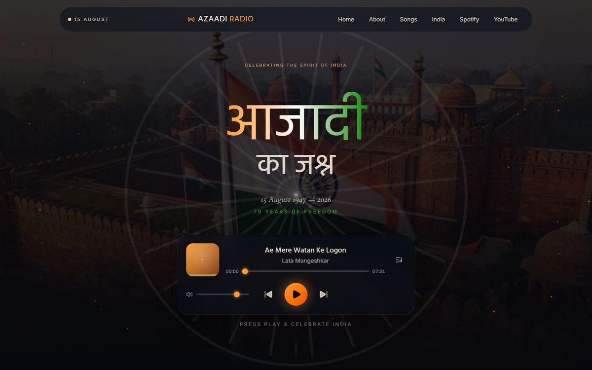
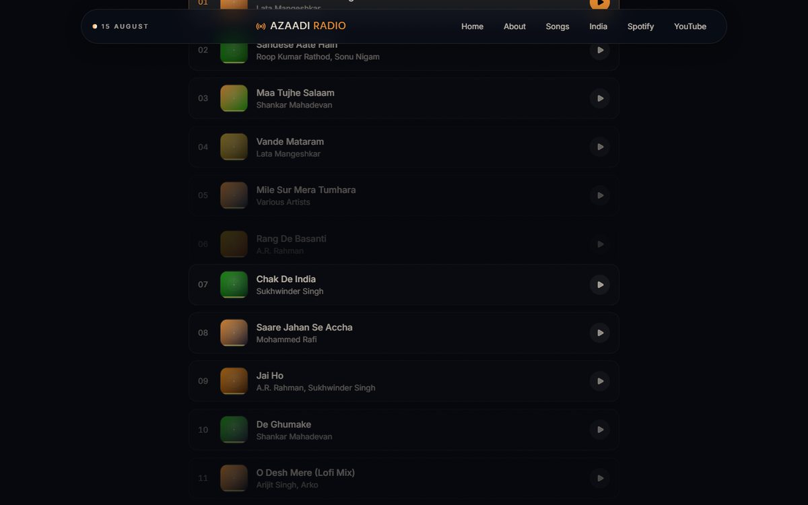
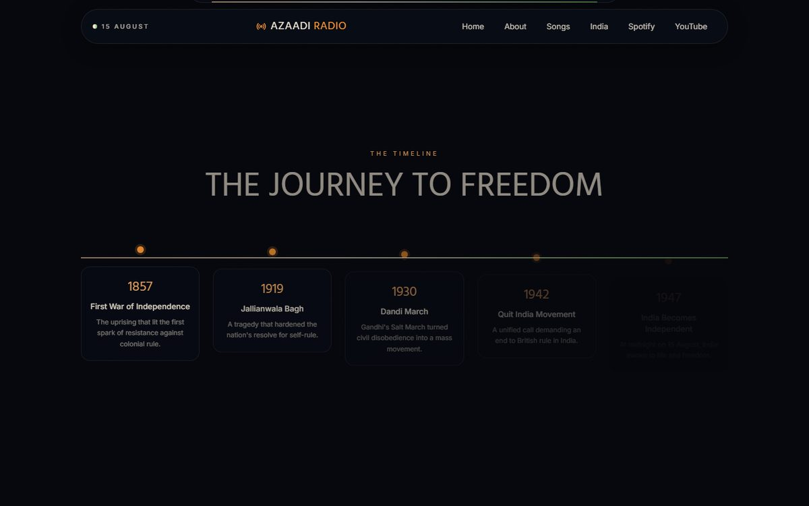
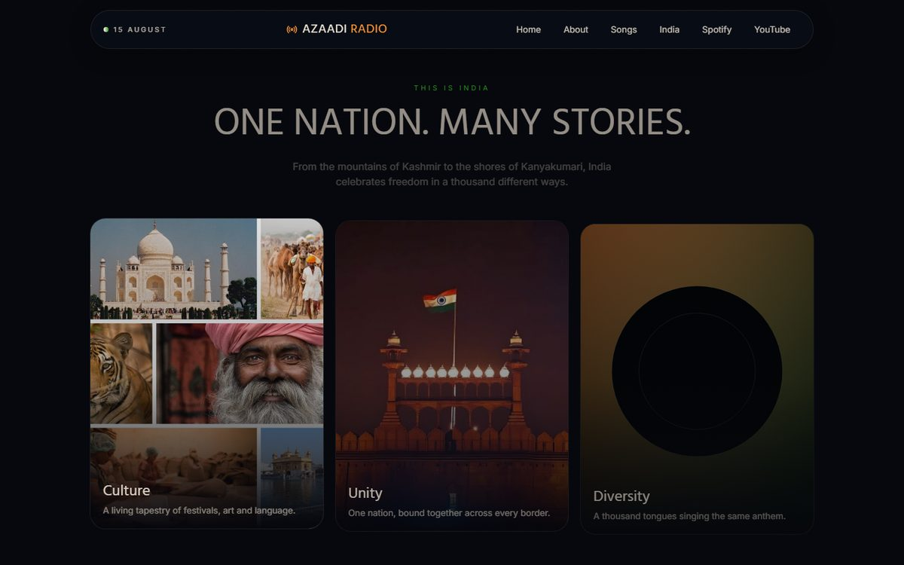
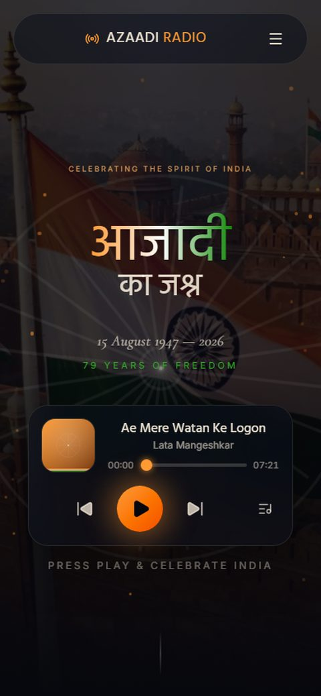

# Azaadi Radio — 15 August Independence Day

A cinematic, music-first Independence Day experience built with React, Vite,
Tailwind CSS v4, Framer Motion and the HTML5 Audio API.

## About the project

Azaadi Radio is a fully original, frontend-only tribute to 15 August /
Indian Independence Day, built around a full-screen music player instead of
a typical static landing page. It combines a patriotic playlist, an
animated Ashoka Chakra, a freedom-movement timeline, and a gallery of
India's culture into one dark, cinematic, tricolor-accented experience.

**Highlights**

- Full-screen hero with a rotating Ashoka Chakra, animated ember particles,
  and a large Devanagari headline (rendered via SVG gradient text for crisp
  cross-browser conjunct shaping)
- Premium floating music player — play/pause, next/previous, seek, volume,
  and auto-advance to the next track, all built on the native HTML5 Audio
  API via a shared `useAudioPlayer` hook (no Redux, no extra state
  libraries)
- 14-track patriotic playlist, synced live between the hero player and the
  playlist section
- Rotating patriotic quotes, a "Journey to Freedom" timeline (1857–1947),
  and a photographic "This Is India" gallery
- Glassmorphic navbar with a mobile hamburger menu, fully responsive from
  mobile to desktop
- No backend — everything is a static asset, deployable as-is to
  Vercel/Netlify

## Screenshots

| Hero | Playlist |
|---|---|
|  |  |

| Journey to Freedom | This Is India |
|---|---|
|  |  |



## Getting started

```bash
npm install
npm run dev
```

Build for production:

```bash
npm run build
```

The output in `dist/` is a static site — deploy it as-is to Vercel, Netlify,
or any static host.

## Replacing the placeholder music

`src/data/songs.js` lists every track. Each entry points to an audio file in
`public/songs/` and a cover image in `public/images/`.

13 of the 14 tracks now play real `.mp3` audio. Only **Vande Mataram**
still uses the silent placeholder tone (`.wav`, generated by
`scripts/gen_placeholder_audio.py`) because no real audio was supplied for
it yet; drop a licensed `.mp3`/`.wav` file into `public/songs/` and update
its `audio` path in `src/data/songs.js` to finish the playlist.

Song cover art in `public/images/` is still generated placeholder artwork
(`scripts/gen_placeholder_covers.py`) — replace with real album art as
needed.

The hero background (`hero-red-fort-flag.jpg`) and 5 of the 6 "This Is
India" cards (`india-culture.jpg`, `india-unity.jpg`, `india-freedom.jpg`,
`india-courage.jpg`, `india-heritage.jpg`) are real photography. Only
**Diversity** (`india-diversity.svg`) still uses the generated placeholder
(`scripts/gen_india_cards.py`) — drop a real photo in as
`india-diversity.jpg` and update its path in
`src/components/IndiaSection.jsx` to finish the set. No backend is
required; everything is a static asset.

## Project structure

```
src/
├── components/   Navbar, Hero, MusicPlayer, Playlist, PlaylistItem,
│                 QuoteSection, FreedomTimeline, IndiaSection, Footer,
│                 AshokaChakra
├── data/songs.js Playlist data
├── hooks/useAudioPlayer.js  Shared HTML5 Audio state
├── App.jsx
└── main.jsx
```

---

Powered by SGS CodeWorks
